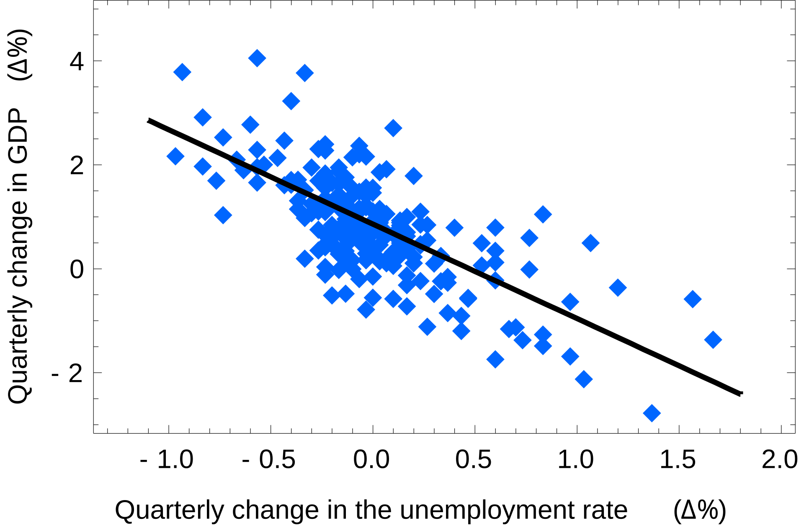
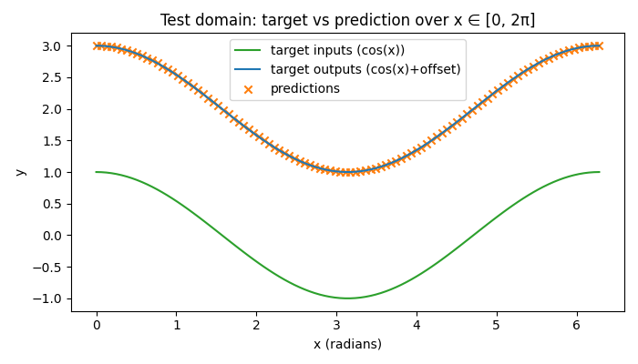

# ml_stuff

A notebook of common ML tasks.

## Linear Regression: The Simplest Neural Network

This class of problems is defined by the goal of predicting a continuous output value based on one or more input variables.

This repository includes a minimal PyTorch example at `neural_nets/simple_add_n.py` that demonstrates linear regression as the simplest form of a neural network.



### Simplest Form of Neural Network
- A linear regression model, whether built in PyTorch or elsewhere, is structurally the simplest form of a neural network. It consists of a single layer with no activation function (or a linear/identity activation function).

### Core Components
- **Weights (W) and Biases (b)**: These are the learnable parameters the model optimizes during training.
- **Linear Transformation**: The core operation is the weighted sum of inputs, expressed as \(\hat{y} = W x + b\).

### PyTorch Implementation
- In PyTorch, a linear model is typically defined using `torch.nn.Linear(input_size, output_size)`.
- The `nn.Linear` class is fundamental to building many neural networks in PyTorch. A simple linear regression model is just a specific, minimal instance of the `nn.Module` architecture.

```python
import torch
import torch.nn as nn

# One-dimensional linear regression: y_hat = w * x + b
model = nn.Sequential(nn.Linear(1, 1))

# Example forward pass with a batch of inputs shaped [N, 1]
x = torch.tensor([[0.0], [1.0], [2.0]])
y_hat = model(x)
```

### Example in This Repo
See `neural_nets/simple_add_n.py` for a complete, commented example that:
  - Creates simple training data,
  - Trains a 1D linear layer with Mean Squared Error (MSE) loss and the Adam optimizer,
  - Evaluates on a test domain and visualizes the results.

The model is trained constant-offset mapping of the form y = x + c. It is then tested for cos(x) target vs prediction over x ∈ [0, 2π].


